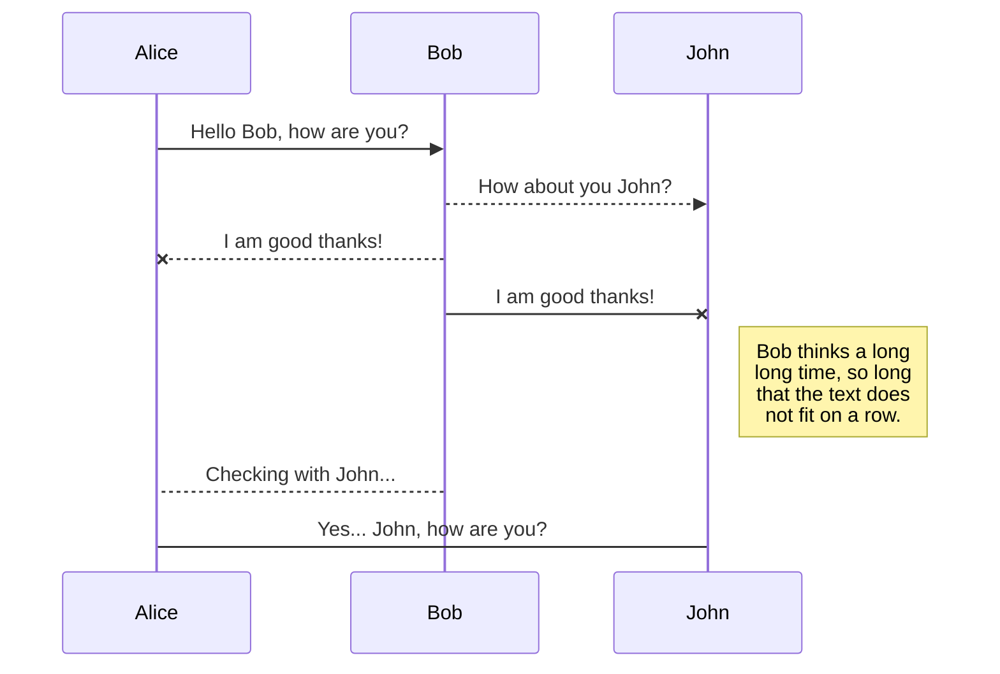
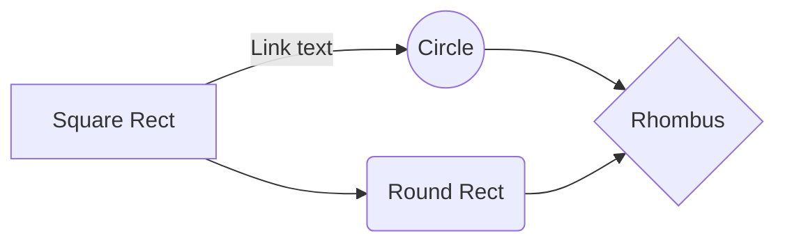

# Gentry Restaurant Management System

  

**Created by Team Vision**

  

- Ang, Mico

- Gomez, Divya

- Maligad, Jam

- Maxey, Adrheinelle

- Mendoza, Rhainne

- Pil, Gabriel

- Pulido, Marco

  

# Project Structure

  

This repository will separate the development for the frontend and the backend.

  

The `backend` folder consists of the main backend files coming from django.

  

The `frontend` folder consists of the main frontend files coming from vuejs.

  

## Backend

  

### Development Setup

  

1. Create a `virtualenv` or `virtualenvwrapper`

2. Navigate to the `/requirements/` folder and run `pip install -r requirements.txt`

3. Create a `local_settings.py` file in the `backend/conf/` directory with the contents below:

  

DATABASES = {

'default': {

'ENGINE': 'django.db.backends.postgresql_psycopg2',

'NAME': 'gentry-system-test-1',

'USER': 'postgres',

'PASSWORD': 'root',

'HOST': 'localhost',

'PORT': '',

}

}

  

4. Apply initial migrations using: `python manage.py migrate`

5. Finally, you may run the server using: `python manage.py runserver <optional: port>`

  

### API documentation
|Module| API | Patterns | Method | Data
|--|--|--|--|--|
| JWT | Access/Bearer Token | `api/token/` | POST | `{"email": str, "password": str}`
| JWT | Refresh Token | `api/token/refresh` | POST | `{"email": str, "password": str}`
| User | List | `api/users/` | GET | `Bearer Token`
| User | Create | `api/users/` | POST | `Bearer Token + {"username": str, "email": str, "first_name": str, "last_name": str, "password": str}`
| User | Detail | `api/users/{pk}/` | GET | `Bearer Token`
| User | Update | `api/users/{pk}/` | PUT | `Bearer Token + {"username": str, "email": str, "first_name": str, "last_name": str, "password": str}`
| Product | List | `api/products/` | GET | `Bearer Token`
| Product | Create | `api/products/` | POST | `Bearer Token + {"name": str, "price": float, "status": int, "description": str}`
| Product | Detail | `api/products/{pk}/` | GET | `Bearer Token`
| Product | Update | `api/products/{pk}/` | PUT | `Bearer Token + {"name": str, "price": float, "status": int, "description": str}`

You may choose any of the following links to view the documentation

 

1. 'localhost:8000/api/swagger/' - View API documentation with Swagger UI

2. 'localhost:8000/api/redoc/' - View API documentation with ReDoc UI

3. 'localhost:8000/api/swagger/.json' - Download API documentation in JSON format

4. 'localhost:8000/api/swagger/.json' - Download API specification in YAML format

  ## Frontend

### Development Setup

  

To be added

  

# Modules

  

Details for modules below will be added soon

  

## User Management

  

To be added

  

## Order Management

  

To be added

  

## Product Management

  

To be added

  

## Inventory Management

  

To be added

  

## UML diagrams (Sample)

  

You can render UML diagrams using [Mermaid](https://mermaidjs.github.io/). For example, this will produce a sequence diagram:

  

  

And this will produce a flow chart:

  

